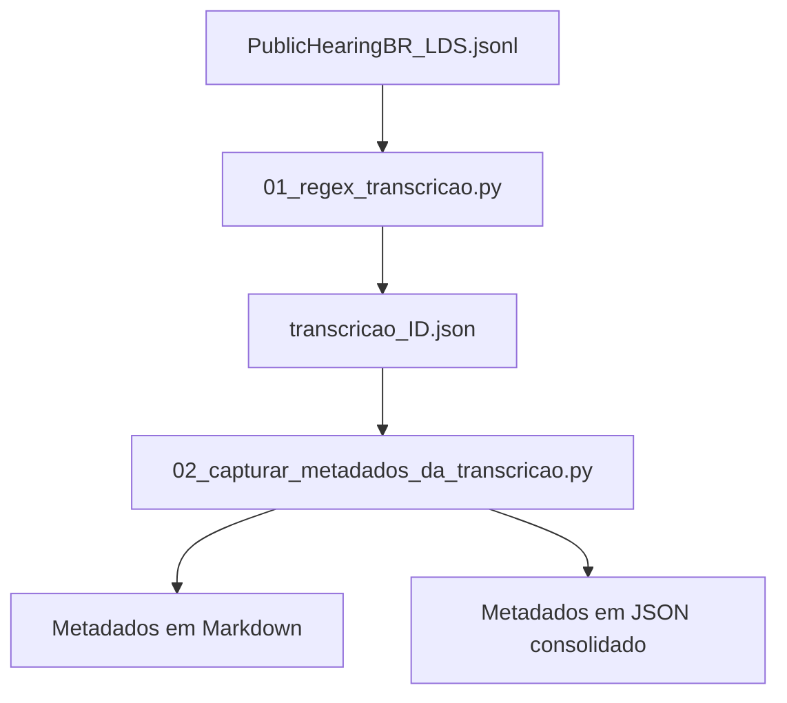

# Estruturação da Transcrição

---

## Objetivo

A primeira etapa do pipeline consiste em **estruturar as transcrições das audiências públicas** do dataset `PublicHearingBR_LDS.jsonl`. Para isso, utilizamos expressões regulares para identificar os participantes e seus respectivos blocos de fala e, em seguida, organizamos os metadados extraídos.

---

## Pipeline



O primeiro script reorganiza cada audiência a partir do seu `id`, identificando os participantes e suas respectivas falas. Ao final, os dados da transcrição reorganizada são armazenados **apenas em JSON**.

O segundo script utiliza o JSON estruturado para gerar metadados sobre os participantes, considerando gênero, partidos, estados, quantidade de falas e quantidade de palavras. Os resultados são armazenados em **Markdown** e em um **JSON consolidado**.

---

## Expressão Regular — Script 01

### Em uma linha

```regex
(?ms)^(?P<gender>O SR\.|A SRA\.)\s+(?P<speaker>[^\r\n(]+?)(?:\s*\((?P<meta>[^)\r\n]*)\))?\s*[-–—]\s*(?P<fala>.*?)(?=^(?:O SR\.|A SRA\.)\s+|\Z)
```

### Versão utilizada no código

```python
SPEECH_RE = re.compile(
    r"(?ms)^(?P<gender>O SR\.|A SRA\.)\s+"
    r"(?P<speaker>[^\r\n(]+?)"
    r"(?:\s*\((?P<meta>[^)\r\n]*)\))?"
    r"\s*[-–—]\s*"
    r"(?P<fala>.*?)(?=^(?:O SR\.|A SRA\.)\s+|\Z)"
)
```

A expressão regular procura os **cabeçalhos de fala** presentes na transcrição, identificados por `O SR.` ou `A SRA.`, e usa esses cabeçalhos para identificar o participante e delimitar o conteúdo associado a ele.

Depois dessa identificação, cada participante passa a ter um **bloco de fala**, que reúne suas falas ao longo da audiência. Esses dados são então organizados e armazenados no JSON da transcrição reorganizada: **team-overthinkers/dataset/transcricao_reorganizada/jsons**.

---

## Metadados — Script 02

Após a estruturação da transcrição em blocos de fala por participante, o segundo script identifica e organiza os seguintes metadados:

* quantidade de participantes;
* gênero;
* partidos;
* estados;
* quantidade de falas e palavras de cada participante;
* quantidade de falas e palavras de cada partido;
* quantidade de falas e palavras de cada estado.

Esses metadados ficam salvos em **team-overthinkers/dataset/transcricao_reorganizada/metadados**.

Essa estrutura constitui a base para as etapas posteriores de análise e para o cruzamento entre a **transcrição** e a **notícia jornalística**.
